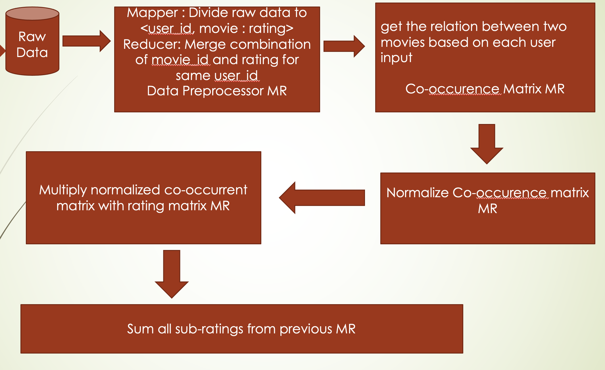

# Movie Recommender System

In this project, by using Hadoop and Docker, I implemented a movie recommender system that can predict movies or videos 
that users may be interested in.

## Design Idea

### Item collaborative filtering v.s. User collaborative filtering
I chose the item collaborative filtering for following reasons:
1. The number of users weighs more than number of products. I need to build a similarity matrix to show the similarities 
   among users or items. If choose user CF, the size of the matrix will be numOfUsers^2; If choose item CF, 
   it will be numOfItems^2
2. Users are human beings, so their interest may change frequently. But item will not change frequently, 
   so lowering calculation
3. From a psychological standpoint, generally, users will not trust someone who they don’t know. 
   If the system tells the users that the recommendation is based on other users, users may feel it’s not trustworthy. 
   Instead, if we use the user’s historical data, it will be more convincing

### Relationship between movies
I chose the rating history to define the relationship between movies. 
Rating history is more accurate than watching history; Because we assume that if a user rates a movie, 
it means that the user is interested in this movie.

The way to represent the relationship between movies is to use co-occurence matrix, 
which can represent how many people watched both movies.

### Five MapReduce Jobs

